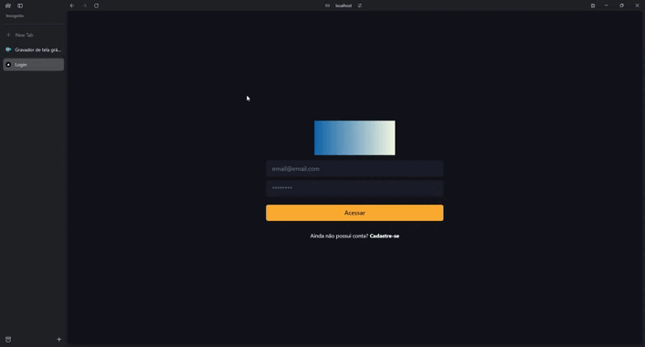

# Login Chakra UI

## Instalação

Instale com npm ou yarn

### Para rodar o front e o back: 💻
```bash
 yarn install ou npm i 
```

### backend
Para rodar aplicação crie antes um arquivo .env com as seguintes informações abaixo:
```bash
#Banco de sua preferência
DATABASE_URL="file:./dev.db"

#JWT SECRET
JWT_SECRET=seu token secreto
```

### Gerar token secreto

Nesse [site](https://www.md5hashgenerator.com/) é possível criar o seu token digitando a senha que deseja e depois clica em Generate e cópia a opção MD5 Hash.

### frontend
Aqui será necessário criar um arquivo .env.local e colocar o endereço onde sua API está rondando, por exemplo:
```bash
NEXT_PUBLIC_API_URL=http://localhost:8000
```

### rodar o projeto
Tanto o frontend como o backend, basta rodar no seu terminal:
```bash
 yarn dev ou
 npm run dev
```

### Login
Para acessar a aplicação eu criei um usuário único para acessar:
```bash
 email: teste@teste.com
 senha: teste
```

